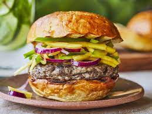

# Ingrédients pour un Burger

- **Pain à Burger** (2 morceaux)
- **Steak Haché** (1)
- **Fromage Cheddar** (2 tranches)
- **Laitue** (feuilles)
- **Tomate** (tranches)
- **Oignon Rouge** (rondelles)
- **Cornichons** (4-5)
- **Ketchup** (1 cuillère à soupe)
- **Moutarde** (1 cuillère à soupe)
- **Mayonnaise** (1 cuillère à soupe)
- **Sel** (au goût)
- **Poivre** (au goût)

